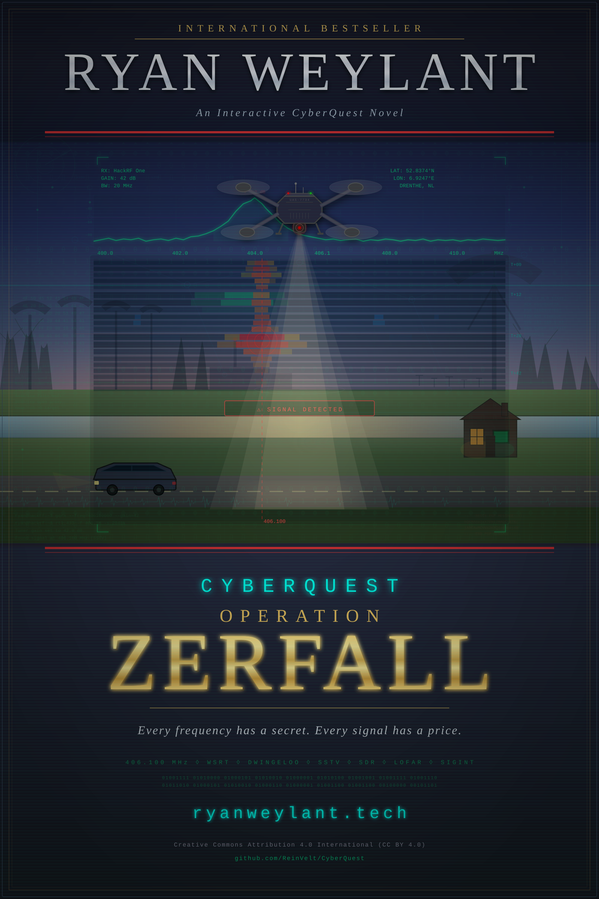

# CyberQuest: Operation ZERFALL



A techno-thriller point-and-click adventure game built with vanilla JavaScript. Featuring realistic hacking scenarios, RF signal analysis, and a story inspired by real-world technology and espionage.

---

## 🎮 Quick Start

**Play Now:** Open `index.html` in any modern browser  
**No installation required** | **Works offline** | **Mobile friendly**  
**Estimated playtime:** 2-4 hours

---

## 📖 Story

You are **Ryan Weylant**, a 55-year-old Dutch hacker living in Compascuum, a quiet village near the German border. Your peaceful morning is disrupted when your SSTV terminal picks up a mysterious transmission from a German military facility. What starts as curiosity becomes a race against time to expose a Russian infiltration operation codenamed **Operation ZERFALL** and prevent a devastating attack.

### Key Characters
- **Ryan Weylant** - Protagonist, hacker, RF enthusiast (you!)
- **Eva Weber ("E")** - Whistleblower inside the facility
- **Dr. Dmitri Volkov** - Soviet weapons researcher, infiltrator
- **Max Weylant** - Ryan's wife, pragmatic support
- **Chris Kubecka** - OSINT expert and security researcher
- **Dr. David Prinsloo** - Antenna expert (TU Eindhoven)
- **Cees Bassa** - LOFAR specialist (ASTRON)
- **Jaap Haartsen** - Bluetooth inventor (real person!)

---

## ✨ Features

- **Sierra-style point-and-click gameplay** with modern web technologies
- **No installation required** - runs entirely in browser with zero dependencies
- **Real-world technology** - Features actual hacking tools (Flipper Zero, HackRF, Meshtastic)
- **18 handcrafted scenes** - From your Dutch farmhouse to a German military facility
- **Evidence-based investigation** - Collect documents, decode messages, piece together the conspiracy
- **Investigation board** - Detective-style cork board to organize clues
- **Regional map** - Michelin-style paper map with accurate GPS coordinates
- **Voice narration** - Optional text-to-speech using Web Speech API
- **Mobile-friendly** - Touch controls fully supported
- **Auto-save** - Progress saved automatically via localStorage
- **No fail states** - Story-focused, not punishing

---

## 🎯 Gameplay

- **Point-and-click** to explore scenes and interact with objects
- **Talk to characters** and build a network of expert allies
- **Collect evidence** and analyze it on your investigation board
- **Decode encrypted messages** (ROT1 cipher puzzle)
- **Use realistic hacking tools** to infiltrate a secure facility
- **Solve puzzles** (passwords, ciphers, stealth challenges)
- **Complete quests** to progress the narrative

---

## 📚 Comprehensive Documentation

This project includes **200+ pages of detailed documentation**:

### 🚀 Start Here
- **[📘 PROJECT_OVERVIEW.md](docs/PROJECT_OVERVIEW.md)** - Complete project overview, FAQ, quick links

### Core Documentation
- **[🏗️ GAME_ARCHITECTURE.md](docs/GAME_ARCHITECTURE.md)** - Technical architecture (70+ pages)
- **[🎮 SYSTEMS.md](docs/SYSTEMS.md)** - All game systems explained (60+ pages)
- **[🗺️ SCENES.md](docs/SCENES.md)** - Complete scene catalog (80+ pages)

### Story & Design
- **[📖 STORY.md](docs/STORY.md)** - Full screenplay (1491 lines, 20 story parts)
- **[🎬 STORYBOARD.md](docs/STORYBOARD.md)** - Visual storyboard with panels
- **[⚙️ RULES.md](docs/RULES.md)** - Game design philosophy

### Quality Assurance
- **[🔍 GAME_FLOW_ANALYSIS.md](docs/GAME_FLOW_ANALYSIS.md)** - Story flow and scene transition analysis
- **[🔒 SECURITY_AUDIT.md](docs/SECURITY_AUDIT.md)** - Static security audit (v1.2)

---

## 🚀 How to Play

### Option 1: Direct (Simplest)
1. Download/clone this repository
2. Open `index.html` in your browser
3. Start playing!

### Option 2: Local Server (Recommended)
```bash
# Python 3
python -m http.server 8000
# Visit http://localhost:8000
```

### Controls
- **Mouse/Touch**: Click to interact with hotspots, advance dialogue
- **I key**: Toggle inventory
- **Q key**: Toggle quest log  
- **Escape**: Close dialogs/menus
- **Voice Toggle**: Click 🔊 button in menu

---

## 💻 Technology Stack

- **Pure HTML/CSS/JavaScript** - No frameworks, no build process, no dependencies
- **SVG Graphics** - Scalable vector graphics for all 33 scenes (~10 MB)
- **Web Speech API** - Optional voice narration
- **localStorage** - Save game progress
- **Pointer Events** - Touch and mouse support
- **Responsive Design** - Desktop and mobile compatible

**Why no frameworks?** Maximum compatibility, zero build complexity, easy to understand and modify, no toolkit rot.

---

## 📁 Project Structure

```
CyberQuest/
├── index.html              # Main game entry point
├── README.md               # This file
├── engine/                 # Core game systems (~5,500 LOC)
│   ├── game.js            # Main engine (4,000+ lines)
│   ├── player.js          # Player character system
│   ├── voice.js           # Voice narration system
│   ├── evidence-viewer.js # Evidence display system
│   ├── chat-interface.js  # Chat UI system
│   ├── styles.css         # Game styles
│   └── puzzles/
│       └── password-puzzle.js # Password/cipher puzzles
├── scenes/                 # 33 game scenes (~22,000 LOC)
│   ├── intro/             # Opening sequence
│   ├── home/              # Kitchen (tutorial)
│   ├── livingroom/        # Living room + TV
│   ├── tvdocumentary/     # Documentary viewing
│   ├── mancave/           # Investigation hub ⭐
│   ├── sdr_bench/         # SDR workbench (SSTV decode)
│   ├── planboard/         # Evidence board
│   ├── regional_map/      # Area map (Michelin style)
│   ├── videocall/         # Video conference with allies
│   ├── garden/            # Backyard + car
│   ├── garden_back/       # Back garden
│   ├── car_discovery/     # Volvo discovery
│   ├── usb_discovery/     # USB find sequence
│   ├── driving/           # Night drive transitions
│   ├── driving_day/       # Daytime drive transitions
│   ├── klooster/          # USB dead drop  
│   ├── dwingeloo/         # Dwingeloo Observatory
│   ├── westerbork_memorial/ # Westerbork memorial
│   ├── astron/            # ASTRON campus
│   ├── lofar/             # LOFAR station
│   ├── hackerspace/       # Hackerspace Drenthe
│   ├── hackerspace_classroom/ # Hackerspace workshop
│   ├── drone_hunt/        # Drone neutralisation puzzle
│   ├── facility/          # Infiltration exterior ⚠️
│   ├── facility_interior/ # Stealth corridors
│   ├── laser_corridor/    # Laser-grid stealth puzzle
│   ├── facility_server/   # Climax scene 🎯
│   ├── long_night/        # Post-infiltration night
│   ├── debrief/           # Aftermath
│   ├── return_to_max/     # Coming home
│   ├── morning_after/     # Next morning
│   ├── epilogue/          # Three months later
│   └── credits/           # End credits
├── assets/
│   ├── images/
│   │   ├── scenes/        # SVG backgrounds (~10 MB)
│   │   ├── icons/         # UI icons and inventory items
│   │   ├── evidence/      # Documents, photos for evidence viewer
│   │   └── characters/    # Character portraits
│   ├── audio/             # Sound effects (future)
│   └── fonts/             # Custom fonts
└── docs/                   # Documentation (200+ pages)
    ├── PROJECT_OVERVIEW.md    # Complete overview
    ├── SECURITY_AUDIT.md      # Security audit report
    ├── GAME_ARCHITECTURE.md   # Technical docs (70+ pages)
    ├── SYSTEMS.md             # Game mechanics (60+ pages)
    ├── SCENES.md              # Scene catalog (80+ pages)
    ├── STORY.md               # Full screenplay (1491 lines)
    └── ...
```

---

## 🗺️ Locations (Accurate GPS Coordinates)

### Netherlands (Drenthe Province)
1. **Compascuum** (52.81°N, 6.97°E) - Ryan's farmhouse (home base)
2. **Ter Apel** (52.9°N, 7.1°E) - Medieval monastery (dead drop)
3. **LOFAR Station** (52.91°N, 6.50°E) - Radio telescope array
4. **WSRT** (52.9°N, 6.6°E) - Westerbork telescope (historic)

### Germany
5. **Steckerdoser Heide** (53.3°N, 7.4°E) - Military R&D facility (target)
6. **Meppen** (52.69°N, 7.29°E) - Border town

**All locations use real GPS coordinates and are accurately mapped!**

---

## 🔧 Technologies Featured

### Real-World Tools
- **SSTV** (Slow Scan Television) - Radio image transmission
- **HackRF One** - Software-defined radio (1 MHz - 6 GHz)
- **Flipper Zero** - RF/NFC/IR multi-tool for security research
- **Meshtastic** - Off-grid encrypted mesh network
- **LOFAR** - Low-frequency radio telescope array (real!)
- **Bluetooth** - Wireless protocol invented by Jaap Haartsen (real person!)

### Puzzles & Challenges
- **ROT1 Cipher** - Simple Caesar cipher (plot point: intentionally weak)
- **Password cracking** - Multiple password puzzles
- **Stealth sequences** - Timing-based infiltration
- **Evidence analysis** - Connect clues detective-style

---

## 🌍 Real-World Inspiration

**This game is inspired by real events and technologies:**

✅ **LOFAR** - Real radio telescope array in Netherlands (ASTRON)
✅ **WSRT** - Westerbork telescope, historic astronomy site  
✅ **Bluetooth** - Jaap Haartsen is the actual inventor  
✅ **Steckerdoser Heide** - Real area in Germany near Meppen  
✅ **Reichsbürger Plot** - 2022 coup attempt in Germany (documented)  
✅ **Russian Influence Ops** - Inspired by documented operations  

🔧 **Project Echo** - Fictional RF weapon (based on real EMP research)  
🔧 **Operation ZERFALL** - Fictional operation (plausible scenario)

**Disclaimer:** This is a work of fiction. While inspired by real technologies and events, all characters and incidents are fictional. This game is entertainment, not a guide for illegal activities.

---

## 💻 Browser Compatibility

| Browser | Version | Status |
|---------|---------|--------|
| Chrome/Edge | 80+ | ✅ Excellent |
| Firefox | 75+ | ✅ Excellent |
| Safari | 13+ | ✅ Good |
| Mobile Chrome | 80+ | ✅ Excellent |
| iOS Safari | 13+ | ✅ Good |

**Recommended:** Modern browsers from 2020+

---

## 📊 Project Statistics

| Category | Count | Details |
|----------|-------|---------|
| **Total Files** | 80+ | HTML, JS, SVG, Docs |
| **Lines of Code** | 27,500+ | Engine + Scenes |
| **Documentation** | 200+ pages | 7+ markdown files |
| **Scenes** | 33 | Fully implemented |
| **Hotspots** | 250+ | Interactive elements |
| **Dialogue Lines** | 2,000+ | All characters |
| **Evidence Docs** | 40+ | Emails, PDFs, images |
| **Quests** | 20+ | Main and side quests |
| **Puzzles** | 5+ | Varied difficulty |

---

## 🎯 Development Status

**Version 1.1 - Production Ready** ✅

### Completed
- ✅ Complete story (20 parts + epilogue)
- ✅ 33 scenes fully implemented
- ✅ All core systems functional (dialogue, inventory, quests, evidence, puzzles)
- ✅ Evidence viewer with multiple document types
- ✅ Password puzzle system with ROT1 decoder
- ✅ Chat interface (Signal-style encrypted messaging)
- ✅ Investigation board (detective cork board)
- ✅ Regional map (Michelin paper map style, accurate GPS)
- ✅ Voice narration (optional, Web Speech API)
- ✅ Mobile support (touch controls)
- ✅ Save/load system (localStorage, format v2)
- ✅ Pause system (P key, menu button)
- ✅ Scene-based clock (SCENE_TIME_MAP)
- ✅ 200+ pages of documentation

### Planned (v1.2+)
- ⏳ Achievement system
- ⏳ Multiple save slots (3-5)
- ⏳ Statistics tracking
- ⏳ Progressive hint system
- ⏳ Accessibility mode (skip puzzles)
- ⏳ Dutch translation
- ⏳ German translation

---

## 🤝 Contributing

Contributions welcome! See [PROJECT_OVERVIEW.md](docs/PROJECT_OVERVIEW.md) for detailed guidelines.

**Ways to contribute:**
- 🐛 Bug reports and testing
- 🌍 Translations (Dutch, German, other languages)
- 🎨 New scenes or assets (SVG backgrounds, icons)
- 🎵 Audio (sound effects, music)
- 📝 Documentation improvements
- 💻 Code improvements (engine, systems)

### Development Setup
```bash
git clone https://github.com/ReinVelt/CyberQuest.git
cd CyberQuest
# No build process! Just open index.html
open index.html

# Or use local server:
python -m http.server 8000
```

---

## � Privacy & Data

**CyberQuest collects no personal data. Full stop.**

- All save data (progress, flags, inventory) is stored **only on your own device** using the browser's `localStorage` API.
- Nothing is transmitted to any server — there is no back-end, no analytics, no tracking.
- **No advertisements.** None. Ever.
- **No Google Analytics**, no Matomo, no tracking pixels, no beacon calls.
- **No third-party scripts** of any kind — no CDN-loaded libraries, no social widgets, no chat bots.
- **No dark patterns** — no cookie banners, consent popups, newsletter nags, or manipulative UI.
- **No accounts**, no sign-up, no cookies (beyond `localStorage` for your own save).
- The entire game is plain **HTML + CSS + JavaScript + images**. What you download is what runs.
- Clearing your browser's `localStorage` will erase your save. That is the only data that exists.

---

## �📜 License & Credits

### License
[CC BY-SA 4.0](https://creativecommons.org/licenses/by-sa/4.0/) — see [LICENSE](LICENSE) for full terms.  
You must credit **Rein Velt** and share derivatives under the same license.

### Created By
Rein Velt  
Development: 2025-2026  
Version: 1.1

### Technology Credits
- **Web Speech API** (W3C Standard)
- **SVG** (W3C Standard)
- **localStorage API** (W3C Standard)

### Special Thanks
- **ASTRON** - LOFAR information
- **TU Eindhoven** - Antenna research
- **Bluetooth SIG** - Protocol history
- **Security research community**
- **Beta testers**

### Story Inspiration
- Drenthe wireless technology pioneers
- Reichsbürger coup plot (2022)
- Documented Russian influence operations
- Modern hacking tools and techniques

---

## 📞 Support

**Documentation:** See [`docs/`](docs/) folder for comprehensive guides  
**Start Here:** [PROJECT_OVERVIEW.md](docs/PROJECT_OVERVIEW.md)  
**Issues:** [GitHub Issues](https://github.com/ReinVelt/CyberQuest/issues)  
**Discussions:** [GitHub Discussions](https://github.com/ReinVelt/CyberQuest/discussions)

---

## 🏆 Version History

**v1.2 (March 7, 2026)** - Production Polish
- 179/179 unit tests passing
- Fixed `_storage` null-injection bug in engine dependency injection
- Production console.log suppression on non-localhost deployments
- Removed debug files from build; all cache-busters bumped to v=7
- CC BY-SA 4.0 license added; README links and placeholders resolved

**v1.1 (February 27, 2026)** - Expanded Release
- Expanded to 33 scenes (15 new scenes)
- Pause system, scene-based clock, save format v2
- Hackerspace, ASTRON, LOFAR, Westerbork scenes
- Laser corridor, drone hunt, long night, return to Max, morning after
- Engine line count: 1490 → 2704

**v1.0 (February 15, 2026)** - Production Release
- Complete game (18 scenes, 20 story parts + epilogue)
- All systems implemented and tested
- 200+ pages of documentation
- Mobile support, voice narration, save/load

---

## 🎯 Quick Links

- **[📘 Start Here: Project Overview](docs/PROJECT_OVERVIEW.md)** - Complete overview, FAQ
- **[🏗️ Architecture Guide](docs/GAME_ARCHITECTURE.md)** - Technical documentation
- **[🎮 Game Systems](docs/SYSTEMS.md)** - Mechanics explained
- **[🗺️ Scene Catalog](docs/SCENES.md)** - All 33 scenes detailed
- **[📖 Full Story](docs/STORY.md)** - Complete screenplay

---

**CyberQuest: Operation ZERFALL**  
*A techno-thriller adventure built with curiosity, code, and coffee.*

**Genre:** Point-and-Click Adventure / Techno-Thriller  
**Platform:** Web Browser (Desktop & Mobile)  
**Status:** v1.1 Production Ready ✅  
**Playtime:** 2-4 hours  

*"When strange signals appear, investigate. But don't do it alone."* — Ryan Weylant
